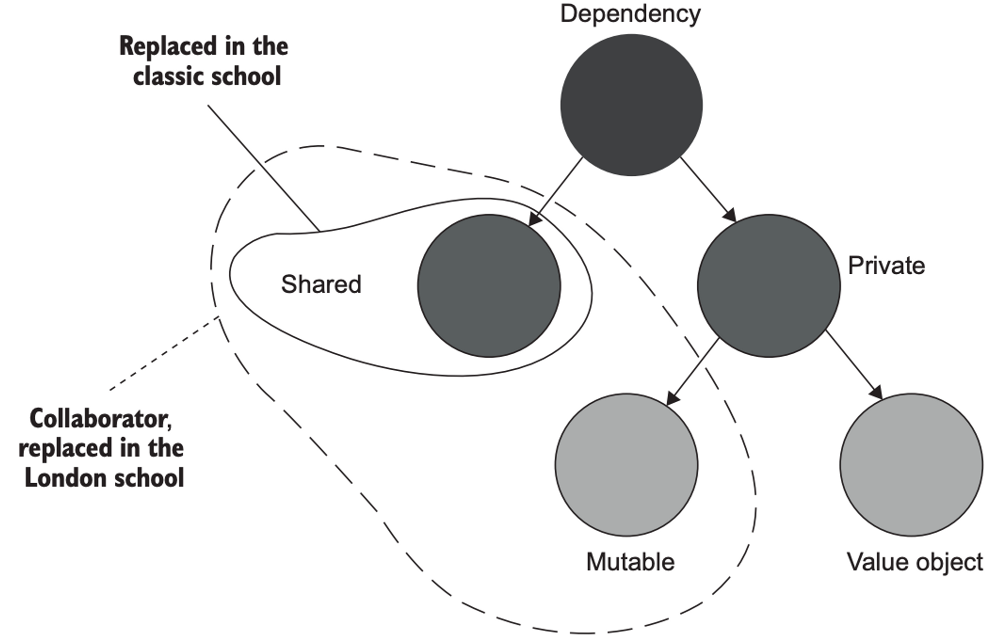
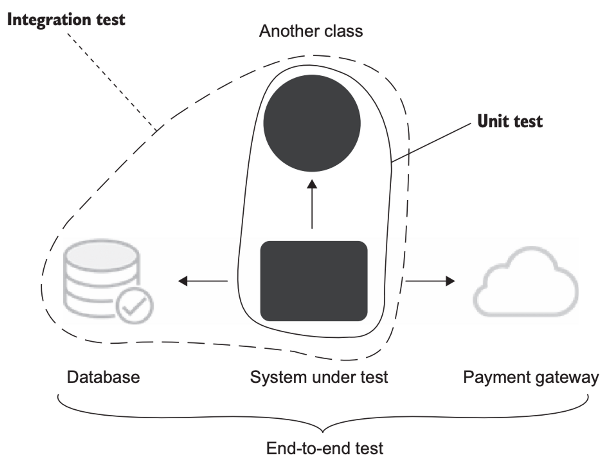

# 2. 단위 테스트란 무엇인가

## 2.1 '단위 테스트'의 정의
- 단위 테스트에서 가장 중요한 세가지
  1. 작은 코드 조각(단위라고도 함)을 검증하고
  2. 빠르게 수행하고
  3. 격리된 방식으로 처리하는 자동화 테스트
- 1과 2는 논란의 여지가 없지만 3에 대해 런던파와 고전파로 나뉜다.
- 런던파에서는 
  - 테스트 대상 시스템을 협력자(collaborator)에서 격리하는 것을 일컫는다.
  - 하나의 클래스가 다른 클래스 또는 여러 클래스에 의존하면 이 모든 의존성을 테스트 대역(test double)으로 대체 해야한다.
  - 이런 식으로동작을 외부 영향과 분리해서 테스트 대상 클래스에만 집중할 수 있다.
  - 이 방법의 이점은
    - 테스트가 실패하면 코드베이스의 어느 부분이 고장 났는지 확실히 알 수 있다.
    - 객체 그래프를 분할할 수 있다. (순환 참조 측면)
    - 클래스의 직접적인 의존성을 대체할 수 있고, 더 나아가 의존성의 의존성을 다룰 필요도 없다.
- 고전파에서는
  - 단위테스트는 서로 격리해서 실행해야 테스트를 어떤 순서로든 가장 적합한 방식으로 실행할 수 있으며 서로의 결과에 영향을 미치지 않는다.
  - 비공유 의존성은 유지
  - 공유 의존성은 테스트 대역으로 대체
- 고전 스타일
    ```java
    public void Purchase_succeeds_when_enough_inventory() {
        // Arrange (준비)
        var store = new Store();
        store.AddInventory(Product.Shampoo, 10);
        var customer = new Customer();
    
        // Act (실행)
        bool success = customer.Purchase(store, Product.Shampoo, 5);
    
        // Assert (검증)
        Assert.True(success);
        Assert.Equal(5, store.GetInventory(Product.Shampoo));
    }
    
    public void Purchase_fails_when_not_enough_inventory() {
        // Arrange
        var store = new Store();
        store.AddInventory(Product.Shampoo, 10);
        var customer = new Customer();
    
        // Act
        bool success = customer.Purchase(store, Product.Shampoo, 15);
        
        // Assert
        Assert.False(success);
        Assert.Equal(10, store.GetInventory(Product.Shampoo));
    }
    
    public enum Product {
        Shampoo,
        Book
    }
    ```
- 런던 스타일
    ```java
    public void Purchase_succeeds_when_enough_inventory() {
        // Arrange
        var storeMock = new Mock<IStore>();
        storeMock
            .Setup(x => x.HasEnoughInventory(Product.Shampoo, 5))
            .Returns(true);
        var customer = new Customer();
    
        // Act
        bool success = customer.Purchase(storeMock.Object, Product.Shampoo, 5);
    
        // Assert
        Assert.True(success);
        storeMock.Verify(
            x => x.RemoveInventory(Product.Shampoo, 5),
            Times.Once
        );
    }
    
    public void Purchase_fails_when_not_enough_inventory() {
        // Arrange
        var storeMock = new Mock<IStore>();
        storeMock
            .Setup(x => x.HasEnoughInventory(Product.Shampoo, 5))
            .Returns(false);
        var customer = new Customer();
    
        // Act
        bool success = customer.Purchase(storeMock.Object, Product.Shampoo, 5);
    
        // Assert
        Assert.False(success);
        storeMock.Verify(
            x => x.RemoveInventory(Product.Shampoo, 5),
            Times.Never
        );
    }
    ```

## 2.2 단위 테스트의 런던파와 고전파
|      | 격리 주체| 단위의 크기 | 테스트 대역 사용 대상 |
|------|------|-----|-------------|
| 런던파	 | 단위	| 클래스 | 값 | 객체 제외 모든 의존성 |
| 고전파	 | 단위 테스트| 동작  | 공유 의존성     |
- [엔디티 대 값 객체 : 궁극적 차이점 목록](https://enterprisecraftsmanship.com/2016/01/11/entity-vs-value-object-the-ultimate-list-of-differences/)


*의존성 계층. 고전파에서는 공유 의존성을 테스트 대역으로 교체한다. 런던파에서는 변경 가능한 한 비공개 의존성도 테스트 대역으로 교체할 수 있다.*

- 값 객체는 의존성이긴 하나 협력자 (collaborator) 는 아니다. 

## 2.3 고전파와 런던파의 비교
- 고전파와 런던파 간의 주요 차이는 단위 테스트의 정의에서 "격리문제"를 어떻게 다루는지에 있다.
- 런던파의 장점에 따른 단점
  - 입자성(granularity)이 좋다. 테스트가 세밀해서 한번에 한 클래스만 확인한다.
    - 테스트는 코드단위가 아니라 동작의 단위여야 한다.
    - 문제 영역에 의미를 두고 테스트가 되어야 한다.
    - 코드의 입자성을 목표로 하는것은 도음이 되지 않는다.
  - 서로 연결된 클래스의 그래프가 커져도 테스트 하기 쉽다.
    - 상호 연결된 클래스의 크고 복잡한 그래프를 방법을 찾는 대신, 먼저 이러한 클래스 그래프를 갖지 않는데 집중
    - 클래스 그래프가 커진 것은 코드 설계 문제의 결과
  - 테스트가 실패하면 어떤 기능이 실패했는지 확실히 알 수 있다. (코드 베이스 기준)
    - 고전방식 이라면 오작동하는 클래스를 참조하는 클라이언트를 대상으로 하는 테스트도 실패한다.
    - 디버깅 시간이 오래 걸릴수 있지만 큰 문제는 아니다.
    - 마지막 수정이 결국 문제의 포인트
- 런던 스타일 단위 테스트
  - 하향식 TDD, 전체 시스템에 대한 기대치를 설정하는 상위 레벨 테스트부터 시작
- 고전 스타일 단위 테스트
  - 상향식 TDD, 도메인 모델을 시작으로 최종 사용자가 소프트웨어를 사용할 수 있을 때까지 계층을 그 위에 더 둔다.

## 2.4 두 분파의 통합테스트
- 런던파
  - 실제 협력자 객체를 사용하는 모든 테스트를 통합 테스트로 간주
  - 고전 스타일로 작성된 대부분의 테스트는 런던파 지지자들에게 통합 테스트로 느껴진다.
- 고전파의 테스트 속성
  - 단일 동작 단위를 검증하고
  - 빠르게 수행하고
  - 다른 테스트와 별도로 처리한다.
- 통합 테스트는 위의 고전파 관점의 속성 세 가지 전부를 충족하지 않는 테스트다.
  - 공유 의존성에 접근하는 테스트는 다른 테스트와 분리해 실행할 수 없다.
  - 프로세스 외부 의존성에 접근하면 테스트가 느려진다.
  - 둘 이상의 동작 단위를 검증할 때의 테스트는 통합 테스트다.
- 엔트 투 엔드 테스트
  - 통합 테스트의 일부
  - 통합테스트는 프로세스 외부 의존성을 한두 개만 갖고 작동
  - 엔드 투 엔드 테스트는 프로세스 외부 의존성을 전부 또는 대다수 갖고 작동
  